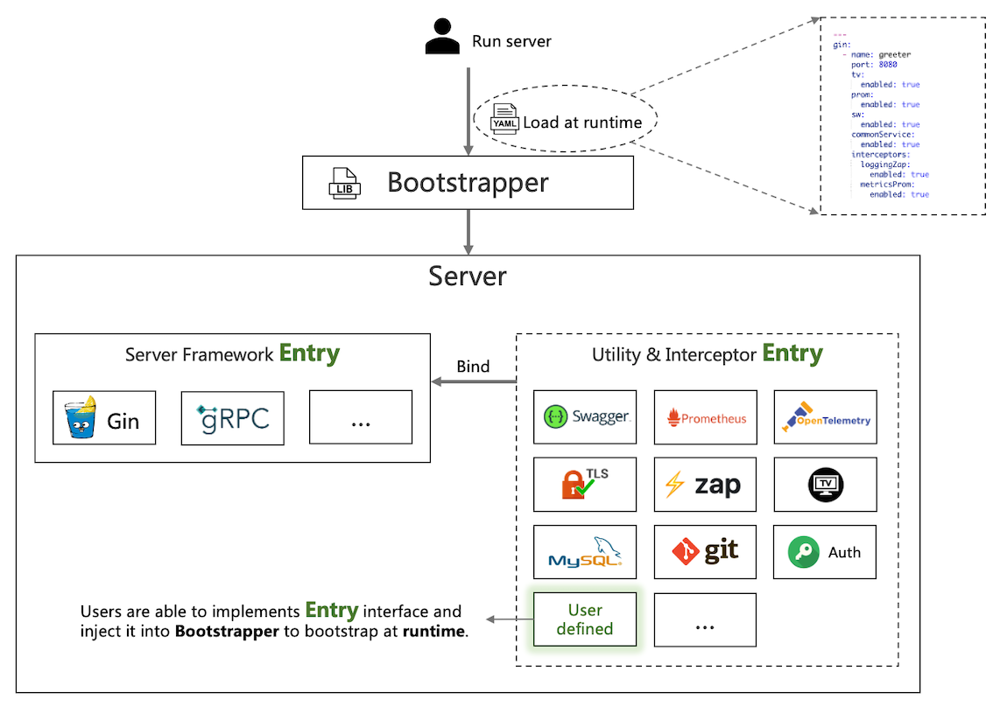

# rk-boot
[](https://github.com/rookie-ninja/rk-boot/actions/workflows/ci.yml)
[](https://codecov.io/gh/rookie-ninja/rk-boot)
[](https://goreportcard.com/report/github.com/rookie-ninja/rk-boot)
[](https://opensource.org/licenses/Apache-2.0)
[](https://app.fossa.com/projects/git%2Bgithub.com%2Frookie-ninja%2Frk-boot?ref=badge_shield)

Bootstrapper for rkentry.Entry.
With rk-boot, users can start gRPC, gin, prometheus client or custom entry service with yaml formatted config file.
Easy to compile, run and debug your grpc service, grpc gateway, swagger UI and rk-tv web UI.

<!-- START doctoc generated TOC please keep comment here to allow auto update -->
<!-- DON'T EDIT THIS SECTION, INSTEAD RE-RUN doctoc TO UPDATE -->
**Table of Contents**  *generated with [DocToc](https://github.com/thlorenz/doctoc)*

- [Online document](#online-document)
- [Concept](#concept)
  - [Why do I want it?](#why-do-i-want-it)
- [Installation](#installation)
- [Quick Start](#quick-start)
  - [Start grpc server from YAML](#start-grpc-server-from-yaml)
  - [Start gin server from YAML](#start-gin-server-from-yaml)
  - [Start echo server from YAML](#start-echo-server-from-yaml)
- [Grpc interceptor](#grpc-interceptor)
    - [Logging interceptor](#logging-interceptor)
  - [Other interceptors](#other-interceptors)
- [Gin middleware](#gin-middleware)
  - [Logging middleware](#logging-middleware)
  - [Other middleware](#other-middleware)
- [Echo middleware](#echo-middleware)
  - [Logging middleware](#logging-middleware-1)
  - [Other interceptors](#other-interceptors-1)
- [gRPC proxy](#grpc-proxy)
- [Development Status: Stable](#development-status-stable)
- [Build instruction](#build-instruction)
- [Test instruction](#test-instruction)
- [Dependencies](#dependencies)
- [Contributing](#contributing)

<!-- END doctoc generated TOC please keep comment here to allow auto update -->

## Online document
[rkdev.info](https://rkdev.info/docs/)

## Concept
rk-boot is a library which support bootstrapping server at runtime. It is a little like [spring boot](https://spring.io/quickstart) way.

### Why do I want it?
- Build application with unified project layout at enterprise level .
- Build API with the unified format of logging, metrics, tracing, authorization at enterprise level.
- Make application replace core dependencies quickly.
- Save learning time of writing initializing procedure of popular frameworks and libraries.
- User defined Entry for customization.



## Installation
`go get github.com/rookie-ninja/rk-boot`

## Quick Start
There are two ways users can run gRPC or Gin service. one is yaml formatted config file.
The other one is through golang code.

### Start grpc server from YAML
- boot.yaml
```yaml
---
grpc:
  - name: greeter             # Required, Name of grpc entry
    port: 8080                # Required, Port of grpc entry
    enabled: true             # Required, Enable grpc entry
    commonService:
      enabled: true           # Optional, Enable common service
    tv:
      enabled: true           # Optional, Enable RK TV
    sw:
      enabled: true           # Optional, Enable Swagger UI
```
- main.go
```go
package main

import (
   "context"
   "github.com/rookie-ninja/rk-boot"
)

// Application entrance.
func main() {
   // Create a new boot instance.
   boot := rkboot.NewBoot()

   // Bootstrap
   boot.Bootstrap(context.Background())

   // Wait for shutdown sig
   boot.WaitForShutdownSig(context.Background())
}
```
```shell script
$ go run main.go
$ curl -X GET localhost:8080/rk/v1/healthy
{"healthy":true}
```
- Swagger: http://localhost:8080/sw


- TV: http://localhost:8080/rk/v1/tv


### Start gin server from YAML
- boot.yaml
```yaml
---
gin:
  - name: greeter       # Required, Name of gin entry
    port: 8080          # Required, Port of gin entry
    enabled: true       # Required, Enable gin entry
    sw:
      enabled: true     # Optional, Enable swagger UI
    commonService:
      enabled: true     # Optional, Enable common service
    tv:
      enabled:  true    # Optional, Enable RK TV
```
- main.go
```go
package main

import (
   "context"
   "github.com/rookie-ninja/rk-boot"
)

func main() {
   // Create a new boot instance.
   boot := rkboot.NewBoot()

   // Bootstrap
   boot.Bootstrap(context.Background())

   // Wait for shutdown sig
   boot.WaitForShutdownSig(context.Background())
}
```
```shell script
$ go run main.go
$ curl -X GET localhost:8080/rk/v1/healthy
{"healthy":true}
```
- Swagger: http://localhost:8080/sw


- TV: http://localhost:8080/rk/v1/tv


### Start echo server from YAML
- boot.yaml
```yaml
---
echo:
  - name: greeter       # Required, Name of gin entry
    port: 8080          # Required, Port of gin entry
    enabled: true       # Required, Enable gin entry
    sw:
      enabled: true     # Optional, Enable swagger UI
    commonService:
      enabled: true     # Optional, Enable common service
    tv:
      enabled:  true    # Optional, Enable RK TV
```
- main.go
```go
package main

import (
   "context"
   "github.com/rookie-ninja/rk-boot"
)

func main() {
   // Create a new boot instance.
   boot := rkboot.NewBoot()

   // Bootstrap
   boot.Bootstrap(context.Background())

   // Wait for shutdown sig
   boot.WaitForShutdownSig(context.Background())
}
```
```shell script
$ go run main.go
$ curl -X GET localhost:8080/rk/v1/healthy
{"healthy":true}
```
- Swagger: http://localhost:8080/sw


- TV: http://localhost:8080/rk/v1/tv


## Grpc interceptor
rk-boot depends on rk-grpc which contains some commonly used middlewares can be used with gin framework directly.
[rk-grpc](https://github.com/rookie-ninja/rk-grpc)
- logging interceptor
- prometheus metrics interceptor
- auth interceptor
- tracing interceptor
- panic interceptor
- metadata interceptor
- rate limit interceptor
- timeout interceptor

#### Logging interceptor
- boot.yaml
```yaml
---
grpc:
  - name: greeter                   # Name of grpc entry
    port: 8080                      # Port of grpc entry
    enabled: true                   # Enable grpc entry
    commonService:
      enabled: true                 # Enable common service for testing
    interceptors:
      loggingZap:
        enabled: true
```
```shell script
$ go run main.go
$ curl -X GET localhost:8080/rk/v1/healthy
{"healthy":true}
```
```shell script
# logs would be printed as bellow.
------------------------------------------------------------------------
endTime=2021-07-09T23:44:09.81483+08:00
startTime=2021-07-09T23:44:09.814784+08:00
elapsedNano=46065
timezone=CST
ids={"eventId":"67d64dab-f3ea-4b77-93d0-6782caf4cfee"}
app={"appName":"rk-demo","appVersion":"master-f414049","entryName":"greeter","entryType":"GrpcEntry"}
env={"arch":"amd64","az":"*","domain":"*","hostname":"lark.local","localIP":"10.8.0.2","os":"darwin","realm":"*","region":"*"}
payloads={"grpcMethod":"Healthy","grpcService":"rk.api.v1.RkCommonService","grpcType":"unaryServer","gwMethod":"","gwPath":"","gwScheme":"","gwUserAgent":""}
error={}
counters={}
pairs={"healthy":"true"}
timing={}
remoteAddr=localhost:58205
operation=/rk.api.v1.RkCommonService/Healthy
resCode=OK
eventStatus=Ended
EOE
```

### Other interceptors
Please refer [online docs](https://rkdev.info/docs/bootstrapper/user-guide/gin-golang/basic/)

## Gin middleware
rk-boot depends on rk-gin which contains some commonly used middlewares can be used with gin framework directly.
[rk-gin](https://github.com/rookie-ninja/rk-gin)
- logging middleware
- prometheus metrics middleware
- auth middleware
- tracing middleware
- panic middleware
- metadata middleware
- rate limit middleware
- timeout middleware
- gzip middleware

### Logging middleware
**No codes needed!**

Enable middleware in boot.yaml file as bellow.
Please refer [online docs](https://rkdev.info/docs) for details.

- boot.yaml
```yaml
gin:
  - name: greeter                             # Required
    port: 8080                                # Required
    enabled: true                             # Required
    commonService:                            # Optional
      enabled: true                           # Optional, default: false
    interceptors:                             # Optional
      loggingZap:
        enabled: true                         # Enable logging middleware
```
```shell script
$ go run main.go
$ curl -X GET localhost:8080/rk/v1/healthy
{"healthy":true}
```
```shell script
# logs would be printed as bellow.
------------------------------------------------------------------------
endTime=2021-07-05T23:42:35.588164+08:00
startTime=2021-07-05T23:42:35.588095+08:00
elapsedNano=69414
timezone=CST
ids={"eventId":"9b874eea-b16b-4c46-b0f5-d2b7cff6844e"}
app={"appName":"rk-demo","appVersion":"master-f414049","entryName":"greeter","entryType":"GinEntry"}
env={"arch":"amd64","az":"*","domain":"*","hostname":"lark.local","localIP":"10.8.0.2","os":"darwin","realm":"*","region":"*"}
payloads={"apiMethod":"GET","apiPath":"/rk/v1/healthy","apiProtocol":"HTTP/1.1","apiQuery":"","userAgent":"curl/7.64.1"}
error={}
counters={}
pairs={}
timing={}
remoteAddr=localhost:56274
operation=/rk/v1/healthy
resCode=200
eventStatus=Ended
EOE
```

### Other middleware
Please refer [online docs](https://rkdev.info/docs/bootstrapper/user-guide/grpc-golang/basic/)

## Echo middleware
rk-boot depends on rk-echo which contains some commonly used middlewares can be used with echo framework directly.
[rk-gin](https://github.com/rookie-ninja/rk-gin)
- logging middleware
- prometheus metrics middleware
- auth middleware
- tracing middleware
- panic middleware
- metadata middleware
- rate limit middleware
- timeout middleware
- rate limit middleware
- timeout middleware
- gzip middleware

### Logging middleware
**No codes needed!**

Enable middleware in boot.yaml file as bellow.
Please refer [online docs](https://rkdev.info/docs) for details.

- boot.yaml
```yaml
echo:
  - name: greeter                             # Required
    port: 8080                                # Required
    enabled: true                             # Required
    commonService:                            # Optional
      enabled: true                           # Optional, default: false
    interceptors:                             # Optional
      loggingZap:
        enabled: true                         # Enable logging middleware
```
```shell script
$ go run main.go
$ curl -X GET localhost:8080/rk/v1/healthy
{"healthy":true}
```
```shell script
# logs would be printed as bellow.
------------------------------------------------------------------------
endTime=2021-07-05T23:42:35.588164+08:00
startTime=2021-07-05T23:42:35.588095+08:00
elapsedNano=69414
timezone=CST
ids={"eventId":"9b874eea-b16b-4c46-b0f5-d2b7cff6844e"}
app={"appName":"rk-demo","appVersion":"master-f414049","entryName":"greeter","entryType":"EchoEntry"}
env={"arch":"amd64","az":"*","domain":"*","hostname":"lark.local","localIP":"10.8.0.2","os":"darwin","realm":"*","region":"*"}
payloads={"apiMethod":"GET","apiPath":"/rk/v1/healthy","apiProtocol":"HTTP/1.1","apiQuery":"","userAgent":"curl/7.64.1"}
error={}
counters={}
pairs={}
timing={}
remoteAddr=localhost:56274
operation=/rk/v1/healthy
resCode=200
eventStatus=Ended
EOE
```

### Other interceptors
Please refer [online docs](https://rkdev.info/docs/bootstrapper/user-guide/echo-golang/basic/)

## gRPC proxy
User can start a gRPC server as proxy server which proxies request to backend gRPC servers.

It is under experimental where docs can be found [here](https://github.com/rookie-ninja/rk-grpc/tree/master/example/boot/proxy).

## Development Status: Stable

## Build instruction
Simply run make all to validate your changes. Or run codes in example/ folder.

- make all
If proto or files in boot/assets were modified, then we need to run it.

## Test instruction
Run unit test with **make test** command.

github workflow will automatically run unit test and golangci-lint for testing and lint validation.

## Dependencies
```
module github.com/rookie-ninja/rk-boot

go 1.16

require (
	github.com/gin-gonic/gin v1.7.2
	github.com/grpc-ecosystem/grpc-gateway/v2 v2.5.0
	github.com/labstack/echo/v4 v4.6.1
	github.com/rookie-ninja/rk-echo v0.0.2
	github.com/rookie-ninja/rk-entry v1.0.3
	github.com/rookie-ninja/rk-gin v1.2.9
	github.com/rookie-ninja/rk-grpc v1.2.11
	github.com/rookie-ninja/rk-prom v1.1.3
	github.com/stretchr/testify v1.7.0
	google.golang.org/grpc v1.38.0
	google.golang.org/protobuf v1.26.0
)
```

## Contributing
We encourage and support an active, healthy community of contributors &mdash;
including you! Details are in the [contribution guide](CONTRIBUTING.md) and
the [code of conduct](CODE_OF_CONDUCT.md). The rk maintainers keep an eye on
issues and pull requests, but you can also report any negative conduct to
lark@rkdev.info.

Released under the [Apache 2.0 License](LICENSE).


## License
[](https://app.fossa.com/projects/git%2Bgithub.com%2Frookie-ninja%2Frk-boot?ref=badge_large)