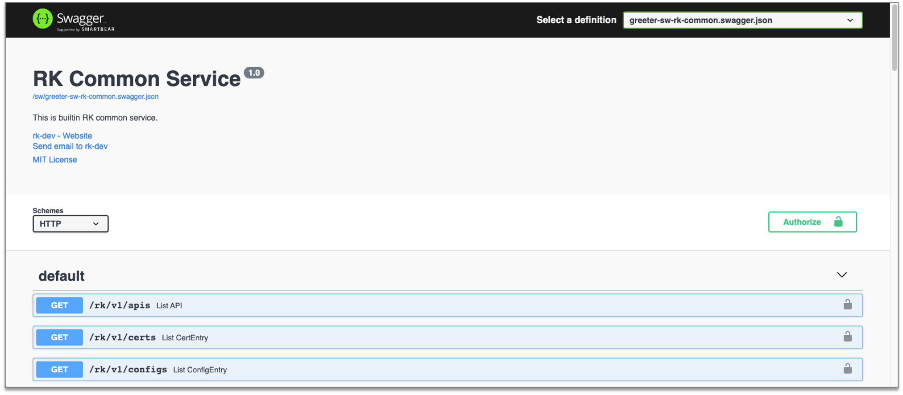
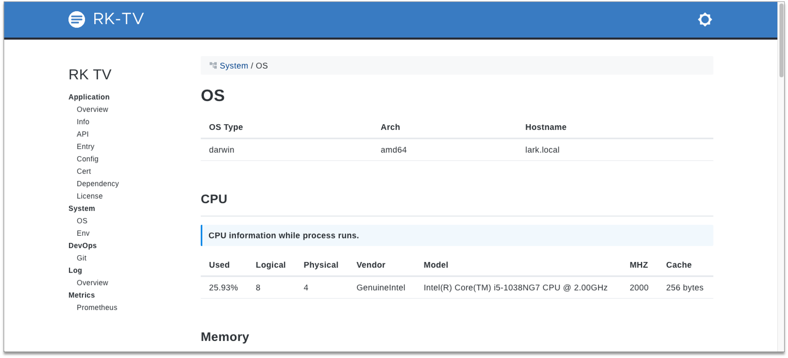

# rk-boot
[](https://github.com/rookie-ninja/rk-boot/actions/workflows/ci.yml)
[](https://codecov.io/gh/rookie-ninja/rk-boot)
[](https://goreportcard.com/report/github.com/rookie-ninja/rk-boot)
[](https://opensource.org/licenses/Apache-2.0)
[](https://app.fossa.com/projects/git%2Bgithub.com%2Frookie-ninja%2Frk-boot?ref=badge_shield)

> **Important note!**
>
> The version of v1.3.X imported rk-gin, rk-echo, rk-grpc and rk-gf in the go.mod file initially. User only needs to [go get rk-boot] for starting web framework.
>
> From v1.4.X, rk-boot will not include those dependencies in one place.
>
> Instead, we use multi-module repository for supported web frameworks.
> 
> | Release | Description | Example |
> | --- | --- | --- |
> | v1.4.x | Use multi-module repository, [go get] submodule as needed for web frameworks | go get github.com/rookie-ninja/rk-boot/gin |
> | v1.3.x | Use root-module repository, will import all web frameworks, not suggested! | go get github.com/rookie-ninja/rk-boot |
> 
> The version of submodule will follow version of rk-xxx dependencies.
> 
> For example, rk-grpc is currently at release of v1.2.15, so the latest version of submodule would be github.com/rookie-ninja/rk-boot/grpc@v1.2.15

Bootstrapper for rkentry.Entry.
With rk-boot, users can start gRPC, gin, echo, GoFrame, prometheus client or custom entry service with yaml formatted config file.
Easy to compile, run and debug your grpc service, grpc gateway, swagger UI and rk-tv web UI.

<!-- START doctoc generated TOC please keep comment here to allow auto update -->
<!-- DON'T EDIT THIS SECTION, INSTEAD RE-RUN doctoc TO UPDATE -->
**Table of Contents**  *generated with [DocToc](https://github.com/thlorenz/doctoc)*

- [Online document](#online-document)
- [Concept](#concept)
  - [Why do I want it?](#why-do-i-want-it)
- [Supported web frameworks](#supported-web-frameworks)
- [Quick Start](#quick-start)
  - [Start grpc server from YAML](#start-grpc-server-from-yaml)
  - [Start gin server from YAML](#start-gin-server-from-yaml)
  - [Start echo server from YAML](#start-echo-server-from-yaml)
  - [Start GoFrame server from YAML](#start-goframe-server-from-yaml)
- [Middlewares](#middlewares)
- [Development Status: Stable](#development-status-stable)
- [Build instruction](#build-instruction)
- [Test instruction](#test-instruction)
- [Dependencies](#dependencies)
- [Contributing](#contributing)

<!-- END doctoc generated TOC please keep comment here to allow auto update -->

## Online document
[rkdev.info](https://rkdev.info/docs/)

## Concept
rk-boot is a library which support bootstrapping server at runtime. It is a little like [spring boot](https://spring.io/quickstart) way.

### Why do I want it?
- Build application with unified project layout at enterprise level .
- Build API with the unified format of logging, metrics, tracing, authorization at enterprise level.
- Make application replace core dependencies quickly.
- Save learning time of writing initializing procedure of popular frameworks and libraries.
- User defined Entry for customization.


## Supported web frameworks
**Welcome to contribute your web framework dependencies into rk-boot family.**

**Start with [docs](https://rkdev.info/docs/bootstrapper/user-guide/gin-golang/developer/) and refer [rk-gin](https://github.com/rookie-ninja/rk-gin) as example.**

| Frameworks | Stage | Tag | Installation | Dependency |
| --- | --- | --- | --- | --- |
| [Gin](https://github.com/gin-gonic/gin) | Stable | v1.2.13 | go get github.com/rookie-ninja/rk-boot/gin | [rk-gin](https://github.com/rookie-ninja/rk-gin) |
| [gRPC](https://grpc.io/)  | Stable | v1.2.16 | go get github.com/rookie-ninja/rk-boot/grpc | [rk-grpc](https://github.com/rookie-ninja/rk-grpc) |
| [Echo](https://github.com/labstack/echo)  | Stable | v0.0.6 | go get github.com/rookie-ninja/rk-boot/echo | [rk-echo](https://github.com/rookie-ninja/rk-echo) |
| [GoFrame](https://github.com/gogf/gf)  | Stable | v0.0.4 | go get github.com/rookie-ninja/rk-boot/gf | [rk-gf](https://github.com/rookie-ninja/rk-gf) |
| [Fiber](https://github.com/gofiber/fiber) | Testing | v0.0.2 | go get github.com/rookie-ninja/rk-boot/fiber | [rk-fiber](https://github.com/rookie-ninja/rk-fiber) |
| [go-zero](https://github.com/zeromicro/go-zero) | Testing | v0.0.1 | go get github.com/rookie-ninja/rk-boot/zero | [rk-zero](https://github.com/rookie-ninja/rk-zero) |
| [GorillaMux](https://github.com/gorilla/mux) | Testing | v0.0.1 | go get github.com/rookie-ninja/rk-boot/mux | [rk-mux](https://github.com/rookie-ninja/rk-mux) |

## Quick Start
There are two ways users can run service. 

- From YAML
- From Code

User needs to [go get] web framework as needed. Bellow web frameworks are supported.

### Start grpc server from YAML
- Installation

`go get github.com/rookie-ninja/rk-boot/grpc`

- boot.yaml
```yaml
---
grpc:
  - name: greeter             # Required, Name of grpc entry
    port: 8080                # Required, Port of grpc entry
    enabled: true             # Required, Enable grpc entry
    commonService:
      enabled: true           # Optional, Enable common service
    tv:
      enabled: true           # Optional, Enable RK TV
    sw:
      enabled: true           # Optional, Enable Swagger UI
```

- main.go
```go
package main

import (
   "context"
   "github.com/rookie-ninja/rk-boot"
   _ "github.com/rookie-ninja/rk-boot/grpc"
)

// Application entrance.
func main() {
   // Create a new boot instance.
   boot := rkboot.NewBoot()

   // Bootstrap
   boot.Bootstrap(context.Background())

   // Wait for shutdown sig
   boot.WaitForShutdownSig(context.Background())
}
```

- go.mod
```
module github.com/rookie-ninja/rk-demo

go 1.16

require (
	github.com/rookie-ninja/rk-boot v1.4.0
	github.com/rookie-ninja/rk-boot/grpc v1.2.15 // indirect
)
```

- validate
```shell script
$ go run main.go
$ curl -X GET localhost:8080/rk/v1/healthy
{"healthy":true}
```

- Swagger: http://localhost:8080/sw



- TV: http://localhost:8080/rk/v1/tv



### Start gin server from YAML
- Installation

`go get github.com/rookie-ninja/rk-boot/gin`

- boot.yaml
```yaml
---
gin:
  - name: greeter       # Required, Name of gin entry
    port: 8080          # Required, Port of gin entry
    enabled: true       # Required, Enable gin entry
    sw:
      enabled: true     # Optional, Enable swagger UI
    commonService:
      enabled: true     # Optional, Enable common service
    tv:
      enabled:  true    # Optional, Enable RK TV
```

- main.go
```go
package main

import (
   "context"
   "github.com/rookie-ninja/rk-boot"
   _ "github.com/rookie-ninja/rk-boot/gin"
)

func main() {
   // Create a new boot instance.
   boot := rkboot.NewBoot()

   // Bootstrap
   boot.Bootstrap(context.Background())

   // Wait for shutdown sig
   boot.WaitForShutdownSig(context.Background())
}
```

- go.mod
```
module github.com/rookie-ninja/rk-demo

go 1.16

require (
	github.com/rookie-ninja/rk-boot v1.4.0
	github.com/rookie-ninja/rk-boot/gin v1.2.12 // indirect
)
```

- validate
```shell script
$ go run main.go
$ curl -X GET localhost:8080/rk/v1/healthy
{"healthy":true}
```

- Swagger: http://localhost:8080/sw


- TV: http://localhost:8080/rk/v1/tv


### Start echo server from YAML
- Installation

`go get github.com/rookie-ninja/rk-boot/echo`

- boot.yaml
```yaml
---
echo:
  - name: greeter       # Required, Name of gin entry
    port: 8080          # Required, Port of gin entry
    enabled: true       # Required, Enable gin entry
    sw:
      enabled: true     # Optional, Enable swagger UI
    commonService:
      enabled: true     # Optional, Enable common service
    tv:
      enabled:  true    # Optional, Enable RK TV
```

- main.go
```go
package main

import (
   "context"
   "github.com/rookie-ninja/rk-boot"
   _ "github.com/rookie-ninja/rk-boot/echo"
)

func main() {
   // Create a new boot instance.
   boot := rkboot.NewBoot()

   // Bootstrap
   boot.Bootstrap(context.Background())

   // Wait for shutdown sig
   boot.WaitForShutdownSig(context.Background())
}
```

- go.mod
```
module github.com/rookie-ninja/rk-demo

go 1.16

require (
	github.com/rookie-ninja/rk-boot v1.4.0
	github.com/rookie-ninja/rk-boot/echo v0.0.5 // indirect
)
```

- validate
```shell script
$ go run main.go
$ curl -X GET localhost:8080/rk/v1/healthy
{"healthy":true}
```

- Swagger: http://localhost:8080/sw


- TV: http://localhost:8080/rk/v1/tv


### Start GoFrame server from YAML
- Installation

`go get github.com/rookie-ninja/rk-boot/gf`

- boot.yaml
```yaml
---
gf:
  - name: greeter       # Required, Name of gin entry
    port: 8080          # Required, Port of gin entry
    enabled: true       # Required, Enable gin entry
    sw:
      enabled: true     # Optional, Enable swagger UI
    commonService:
      enabled: true     # Optional, Enable common service
    tv:
      enabled:  true    # Optional, Enable RK TV
```

- main.go
```go
package main

import (
   "context"
   "github.com/rookie-ninja/rk-boot"
   _ "github.com/rookie-ninja/rk-boot/gf"
)

func main() {
   // Create a new boot instance.
   boot := rkboot.NewBoot()

   // Bootstrap
   boot.Bootstrap(context.Background())

   // Wait for shutdown sig
   boot.WaitForShutdownSig(context.Background())
}
```

- go.mod
```
module github.com/rookie-ninja/rk-demo

go 1.16

require (
	github.com/rookie-ninja/rk-boot v1.4.0
	github.com/rookie-ninja/rk-boot/gf v0.0.3 // indirect
)
```

- validate
```shell script
$ go run main.go
$ curl -X GET localhost:8080/rk/v1/healthy
{"healthy":true}
```

- Swagger: http://localhost:8080/sw


- TV: http://localhost:8080/rk/v1/tv


## Middlewares
| Framework | Docs |
| --- | --- |
| [Gin](https://github.com/gin-gonic/gin) | [rk-gin](https://github.com/rookie-ninja/rk-gin) |
| [gRPC](https://grpc.io/) | [rk-grpc](https://github.com/rookie-ninja/rk-grpc) |
| [Echo](https://github.com/labstack/echo) | [rk-echo](https://github.com/rookie-ninja/rk-echo) |
| [GoFrame](https://github.com/gogf/gf) | [rk-gf](https://github.com/rookie-ninja/rk-gf) |
| [Fiber](https://github.com/gofiber/fiber) | [rk-fiber](https://github.com/rookie-ninja/rk-fiber) |
| [go-zero](https://github.com/zeromicro/go-zero) | [rk-zero](https://github.com/rookie-ninja/rk-zero) |
| [GorillaMux](https://github.com/gorilla/mux) | [rk-mux](https://github.com/rookie-ninja/rk-mux) |

## Development Status: Stable

## Build instruction
Simply run make all to validate your changes. Or run codes in example/ folder.

- make all
If proto or files in boot/assets were modified, then we need to run it.

## Test instruction
Run unit test with **make test** command.

github workflow will automatically run unit test and golangci-lint for testing and lint validation.

## Dependencies
```
module github.com/rookie-ninja/rk-boot

go 1.16

require (
	github.com/rookie-ninja/rk-entry v1.0.4
	github.com/rookie-ninja/rk-prom v1.1.4
	github.com/stretchr/testify v1.7.0
)
```

## Contributing
We encourage and support an active, healthy community of contributors &mdash;
including you! Details are in the [contribution guide](CONTRIBUTING.md) and
the [code of conduct](CODE_OF_CONDUCT.md). The rk maintainers keep an eye on
issues and pull requests, but you can also report any negative conduct to
lark@rkdev.info.

Released under the [Apache 2.0 License](LICENSE).


## License
[](https://app.fossa.com/projects/git%2Bgithub.com%2Frookie-ninja%2Frk-boot?ref=badge_large)