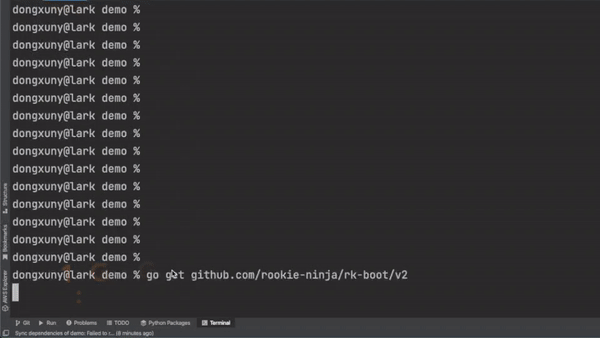

<p align="center">
  <a href="https://rkdev.info"></a> 
</p>
<p align="center">
  Build microservice with rk-boot and let the team take over clean and tidy code.
</p>
<p align="center">
 <a href="https://github.com/rookie-ninja/rk-boot/actions/workflows/ci.yml"></a>
 <a href="https://codecov.io/gh/rookie-ninja/rk-boot"></a>
 <a href="https://goreportcard.com/report/github.com/rookie-ninja/rk-boot"></a>
 <a href="https://sourcegraph.com/github.com/rookie-ninja/rk-boot?badge"></a>
 <a href="https://godoc.org/github.com/rookie-ninja/rk-boot"></a>
 <a href="https://github.com/rookie-ninja/rk-boot/releases"></a>
 <a href="https://opensource.org/licenses/Apache-2.0"></a>
<p>

<div id="badges" align="center">
  <a href="https://medium.com/@pointgoal">
    
  </a>
  <a href="https://rkdev.info">
    
  </a>
  <a href="https://rk-syz1767.slack.com/">
    
  </a>
</div>

<p align="center">
 <a href=""></a>
<p>

## Concept
rk-boot is a library which can manage backend service dependencies with YAML.

Standardize, unify and simplify microservice is huge challenge when project are getting bigger. Build microservice with rk-boot and let the team take over clean and tidy code.


## Quick Start
We will start [gin-gonic/gin](https://github.com/gin-gonic/gin) server with rk-boot.

### Install 

```shell
go get github.com/rookie-ninja/rk-boot/v2
go get github.com/rookie-ninja/rk-gin/v2
```

### Code

<details>
  <summary>boot.yaml</summary>

```yaml
---
gin:
  - name: greeter                                          # Required
    port: 8080                                             # Required
    enabled: true                                          # Required
    sw:
      enabled: true                                        # Optional, default: false
```
</details>

<details>
  <summary>main.go</summary>

```go
// Copyright (c) 2021 rookie-ninja
//
// Use of this source code is governed by an Apache-style
// license that can be found in the LICENSE file.

package main

import (
	"context"
	"fmt"
	"github.com/gin-gonic/gin"
	"github.com/rookie-ninja/rk-boot/v2"
	"github.com/rookie-ninja/rk-gin/v2/boot"
	"net/http"
)

// @title Swagger Example API
// @version 1.0
// @description This is a sample rk-demo server.
// @termsOfService http://swagger.io/terms/

// @securityDefinitions.basic BasicAuth

// @contact.name API Support
// @contact.url http://www.swagger.io/support
// @contact.email support@swagger.io

// @license.name Apache 2.0
// @license.url http://www.apache.org/licenses/LICENSE-2.0.html
func main() {
	// Create a new boot instance.
	boot := rkboot.NewBoot()

	// Register handler
	entry := rkgin.GetGinEntry("greeter")
	entry.Router.GET("/v1/greeter", Greeter)

	// Bootstrap
	boot.Bootstrap(context.TODO())

	boot.WaitForShutdownSig(context.TODO())
}

// Greeter handler
// @Summary Greeter
// @Id 1
// @Tags Hello
// @version 1.0
// @Param name query string true "name"
// @produce application/json
// @Success 200 {object} GreeterResponse
// @Router /v1/greeter [get]
func Greeter(ctx *gin.Context) {
	ctx.JSON(http.StatusOK, &GreeterResponse{
		Message: fmt.Sprintf("Hello %s!", ctx.Query("name")),
	})
}

type GreeterResponse struct {
	Message string
}
```
</details>

### Validate

<details>
  <summary>Check API</summary>

```shell script
$ go run main.go

$ curl -X GET localhost:8080/v1/greeter?name=rk-dev
{"Message":"Hello rk-dev!"}

$ curl -X GET localhost:8080/rk/v1/ready
{
  "ready": true
}

$ curl -X GET localhost:8080/rk/v1/alive
{
  "alive": true
}
```
</details>

<details>
  <summary>Check Swagger UI</summary>

Swagger UI: [http://localhost:8080/sw](http://localhost:8080/sw)


</details>

## Supported plugins
<table>
    <tr>
        <td align="center" valign="middle"><a href="https://docs.rkdev.info/docs/rk-boot/getting-started/gin/" target="_blank"></a></td>
        <td align="center" valign="middle"><a href="https://docs.rkdev.info/docs/rk-boot/getting-started/grpc/" target="_blank"></a></td>
        <td align="center" valign="middle"><a href="https://docs.rkdev.info/docs/rk-boot/getting-started/echo/" target="_blank"></a></td>
        <td align="center" valign="middle"><a href="https://docs.rkdev.info/docs/rk-boot/getting-started/gf/" target="_blank"></a></td>
        <td align="center" valign="middle"><a href="https://docs.rkdev.info/docs/rk-boot/getting-started/fiber/" target="_blank"></a></td>
    </tr>
    <tr>
        <td align="center" valign="middle"><a href="https://docs.rkdev.info/docs/rk-boot/getting-started/zero/" target="_blank"></a></td>
        <td align="center" valign="middle"><a href="https://docs.rkdev.info/docs/rk-boot/getting-started/mux/" target="_blank"></a></td>
        <td align="center" valign="middle"><a href="https://docs.rkdev.info/docs/rk-boot/getting-started/database/mysql/" target="_blank"></a></td>
        <td align="center" valign="middle"><a href="https://docs.rkdev.info/docs/rk-boot/getting-started/database/sqlite/" target="_blank"></a></td>
        <td align="center" valign="middle"><a href="https://docs.rkdev.info/docs/rk-boot/getting-started/database/sqlserver/" target="_blank"></a></td>
    </tr>
    <tr>
        <td align="center" valign="middle"><a href="https://docs.rkdev.info/docs/rk-boot/getting-started/database/postgres/" target="_blank"></a></td>
        <td align="center" valign="middle"><a href="https://docs.rkdev.info/docs/rk-boot/getting-started/database/clickhouse/" target="_blank"></a></td>
        <td align="center" valign="middle"><a href="https://docs.rkdev.info/docs/rk-boot/getting-started/database/mongodb/" target="_blank"></a></td>
        <td align="center" valign="middle"><a href="https://docs.rkdev.info/docs/rk-boot/getting-started/database/redis/" target="_blank"></a></td>
        <td align="center" valign="middle"><a href="https://github.com/rookie-ninja/rk-cloud" target="_blank"></a></td>
    </tr>
    <tr>
        <td align="center" valign="middle"><a href="https://github.com/rookie-ninja/rk-cloud" target="_blank"></a></td>
        <td align="center" valign="middle"><a href="https://docs.rkdev.info/docs/rk-boot/user-guide/gin/basic/swagger-ui/" target="_blank"></a></td>
        <td align="center" valign="middle"><a href="https://docs.rkdev.info/docs/rk-boot/user-guide/gin/basic/prometheus-client/" target="_blank"></a></td>
        <td align="center" valign="middle"><a href="https://docs.rkdev.info/docs/rk-boot/user-guide/gin/basic/docs-ui/" target="_blank"></a></td>
        <td align="center" valign="middle"><a href="https://docs.rkdev.info/docs/rk-boot/user-guide/gin/basic/pprof/" target="_blank"></a></td>
    </tr>
    <tr>
        <td align="center" valign="middle"><a href="https://docs.rkdev.info/docs/rk-boot/user-guide/gin/advanced/config/" target="_blank"></a></td>
        <td align="center" valign="middle"><a href="https://docs.rkdev.info/docs/rk-boot/user-guide/gin/advanced/logging/" target="_blank"></a></td>
        <td align="center" valign="middle"><a href="https://docs.rkdev.info/docs/rk-boot/user-guide/gin/advanced/tls/" target="_blank"></a></td>
        <td align="center" valign="middle"><a href="https://docs.rkdev.info/docs/rk-boot/user-guide/gin/basic/middleware-gzip/" target="_blank"></a></td>
        <td align="center" valign="middle"><a href="https://docs.rkdev.info/docs/rk-boot/user-guide/gin/basic/middleware-timeout/" target="_blank"></a></td>
    </tr>
    <tr>
        <td align="center" valign="middle"><a href="https://docs.rkdev.info/docs/rk-boot/user-guide/gin/basic/middleware-csrf/" target="_blank"></a></td>
        <td align="center" valign="middle"><a href="https://docs.rkdev.info/docs/rk-boot/user-guide/gin/basic/middleware-cors/" target="_blank"></a></td>
        <td align="center" valign="middle"><a href="https://docs.rkdev.info/docs/rk-boot/user-guide/gin/basic/middleware-jwt/" target="_blank"></a></td>
        <td align="center" valign="middle"><a href="https://docs.rkdev.info/docs/rk-boot/user-guide/gin/basic/middleware-auth/" target="_blank"></a></td>
        <td align="center" valign="middle"><a href="https://docs.rkdev.info/docs/rk-boot/user-guide/gin/basic/middleware-tracing/" target="_blank"></a></td>
    </tr>
</table>

## Development Status: Stable

## Build instruction
Simply run make all to validate your changes. Or run codes in example/ folder.

- make all
  If proto or files in boot/assets were modified, then we need to run it.

## Test instruction
Run unit test with **make test** command.

github workflow will automatically run unit test and golangci-lint for testing and lint validation.

## Contributing
We encourage and support an active, healthy community of contributors &mdash;
including you! Details are in the [contribution guide](CONTRIBUTING.md) and
the [code of conduct](CODE_OF_CONDUCT.md). The rk maintainers keep an eye on
issues and pull requests, but you can also report any negative conduct to
lark@rkdev.info.

Released under the [Apache 2.0 License](LICENSE).

## Join discussing channel
| Channel                 | Code                                             |
|-------------------------|--------------------------------------------------|
| Wechat group (Chinese)  |            |
| Slack channel (English) | [#rk-boot](https://rk-syz1767.slack.com/) |

## Star History

[](https://star-history.com/#rookie-ninja/rk-boot&Date)
