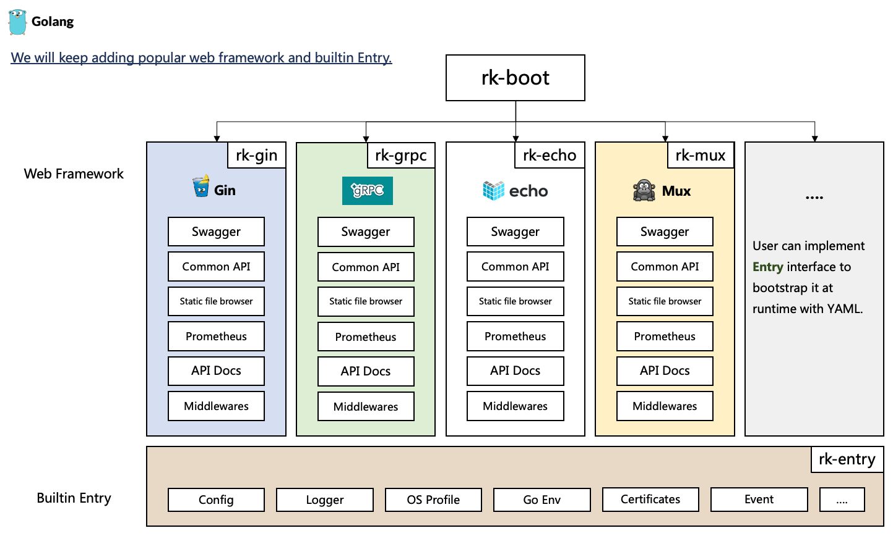

# rk-boot
[](https://github.com/rookie-ninja/rk-boot/actions/workflows/ci.yml)
[](https://codecov.io/gh/rookie-ninja/rk-boot)
[](https://goreportcard.com/report/github.com/rookie-ninja/rk-boot)
[](https://opensource.org/licenses/Apache-2.0)

<!-- START doctoc generated TOC please keep comment here to allow auto update -->
<!-- DON'T EDIT THIS SECTION, INSTEAD RE-RUN doctoc TO UPDATE -->
**Table of Contents**  *generated with [DocToc](https://github.com/thlorenz/doctoc)*

- [Important note](#important-note)
- [Official document](#official-document)
- [Concept](#concept)
  - [Goal](#goal)
  - [Why do I want it?](#why-do-i-want-it)
- [Features](#features)
  - [Supported web frameworks](#supported-web-frameworks)
  - [Supported database ORM](#supported-database-orm)
- [Examples](#examples)
- [Quick Start for Gin](#quick-start-for-gin)
- [Development Status: Stable](#development-status-stable)
- [Build instruction](#build-instruction)
- [Test instruction](#test-instruction)
- [Contributing](#contributing)

<!-- END doctoc generated TOC please keep comment here to allow auto update -->

## Important note
> The version of v1.3.X imported rk-gin, rk-echo, rk-grpc and rk-gf in the go.mod file initially. User only needs to [go get rk-boot] for starting web framework.
>
> From v1.4.X, rk-boot will not include those dependencies in one place.
>
> Instead, we use multi-module repository for supported web frameworks.
> 
> | Release | Description | Example |
> | --- | --- | --- |
> | v1.4.x | Use multi-module repository, [go get] submodule as needed for web frameworks | go get github.com/rookie-ninja/rk-boot/gin |
> | v1.3.x | Use root-module repository, will import all web frameworks, not suggested! | go get github.com/rookie-ninja/rk-boot |
> 
> The version of submodule will follow version of rk-xxx dependencies.
> 
> For example, rk-grpc is currently at release of v1.2.15, so the latest version of submodule would be github.com/rookie-ninja/rk-boot/grpc@v1.2.15

## Official document
[rkdev.info](https://rkdev.info/docs/)

## Concept
rk-boot is a library which support bootstrapping server at runtime via YAML file. It is a little like [spring boot](https://spring.io/quickstart) way.



### Goal
We hope user can achieve bellow goals while designing/implementing microservice.

- 1: **Decide** which dependencies to use. (For example, MySQL, Redis, AWS, Gin are the required dependencies.)
- 2: **Add** dependencies in boot.yaml (where rk-boot will automatically initiate dependency client instances.)
- 3: **Implement** your own codes (without caring about logging, metrics and tracing of dependency client.)
- 4: **Monitor** service and dependency (via a standard dashboard.)

We are planning to achieve this goal by unify dependency input(by boot.yaml) and output(logging format, metrics format etc).

We will add more bootstrapper for popular third-party dependencies.

### Why do I want it?
- Build application with unified project layout at enterprise level .
- Build API with the unified format of logging, metrics, tracing, authorization at enterprise level.
- Make application replace core dependencies quickly.
- Save learning time of writing initializing procedure of popular frameworks and libraries.
- User defined Entry for customization.

## Features
### Supported web frameworks
**Welcome to contribute your web framework dependencies into rk-boot family.**

**Start with [docs](https://rkdev.info/docs/bootstrapper/user-guide/gin-golang/developer/) and refer [rk-gin](https://github.com/rookie-ninja/rk-gin) as example.**

| Frameworks                                                | Status  | Tag     | Installation                                 | Dependency                                           |
|-----------------------------------------------------------|---------|---------|----------------------------------------------|------------------------------------------------------|
| [gin-gonic/gin](https://github.com/gin-gonic/gin)         | Stable  | v1.2.22 | go get github.com/rookie-ninja/rk-boot/gin   | [rk-gin](https://github.com/rookie-ninja/rk-gin)     |
| [gRPC](https://grpc.io/docs/languages/go/)                | Stable  | v1.2.25 | go get github.com/rookie-ninja/rk-boot/grpc  | [rk-grpc](https://github.com/rookie-ninja/rk-grpc)   |
| [labstack/echo](https://github.com/labstack/echo)         | Stable  | v0.0.16 | go get github.com/rookie-ninja/rk-boot/echo  | [rk-echo](https://github.com/rookie-ninja/rk-echo)   |
| [gogf/gf](https://github.com/gogf/gf)                     | Stable  | v0.0.15 | go get github.com/rookie-ninja/rk-boot/gf    | [rk-gf](https://github.com/rookie-ninja/rk-gf)       |
| [gofiber/fiber](https://github.com/gofiber/fiber)         | Testing | v0.0.11 | go get github.com/rookie-ninja/rk-boot/fiber | [rk-fiber](https://github.com/rookie-ninja/rk-fiber) |
| [zeromicro/go-zero](https://github.com/zeromicro/go-zero) | Testing | v0.0.11 | go get github.com/rookie-ninja/rk-boot/zero  | [rk-zero](https://github.com/rookie-ninja/rk-zero)   |
| [gorilla/mux](https://github.com/gorilla/mux)             | Testing | v0.0.9  | go get github.com/rookie-ninja/rk-boot/mux   | [rk-mux](https://github.com/rookie-ninja/rk-mux)     |

### Supported database ORM
Databases still in Testing stage. Please see [examples](example/database) for detail.

| Database   | Status | Tag    | ORM                      | Installation                                    | Dependency                                                           |
|------------|--------|--------|--------------------------|-------------------------------------------------|----------------------------------------------------------------------|
| MySQL      | Stable | v0.0.6 | [gorm](https://gorm.io/) | go get github.com/rookie-ninja/rk-db/mysql      | [rk-db/mysql](https://github.com/rookie-ninja/rk-db/mysql)           |
| SQLite     | Stable | v0.0.4 | [gorm](https://gorm.io/) | go get github.com/rookie-ninja/rk-db/sqlite     | [rk-db/sqlite](https://github.com/rookie-ninja/rk-db/sqlite)         |
| SQL Server | Stable | v0.0.4 | [gorm](https://gorm.io/) | go get github.com/rookie-ninja/rk-db/sqlserver  | [rk-db/sqlserver](https://github.com/rookie-ninja/rk-db/sqlserver)   |
| postgreSQL | Stable | v0.0.4 | [gorm](https://gorm.io/) | go get github.com/rookie-ninja/rk-db/postgres   | [rk-db/postgres](https://github.com/rookie-ninja/rk-db/postgres)     |
| ClickHouse | Stable | v0.0.4 | [gorm](https://gorm.io/) | go get github.com/rookie-ninja/rk-db/clickhouse | [rk-db/clickhouse](https://github.com/rookie-ninja/rk-db/clickhouse) |

## Examples
| Name                                                      | Type                                          | Example                                | Docs                        |
|-----------------------------------------------------------|-----------------------------------------------|----------------------------------------|-----------------------------|
| [gin-gonic/gin](https://github.com/gin-gonic/gin)         | Web Framework                                 | [example](example/gin)                 | [docs](gin)                 |
| [gRPC](https://grpc.io/docs/languages/go/)                | Web Framework                                 | [example](example/grpc)                | [docs](grpc)                |
| [labstack/echo](https://github.com/labstack/echo)         | Web Framework                                 | [example](example/echo)                | [docs](echo)                |
| [gogf/gf](https://github.com/gogf/gf)                     | Web Framework                                 | [example](example/gf)                  | [docs](gf)                  |
| [gofiber/fiber](https://github.com/gofiber/fiber)         | Web Framework                                 | [example](example/fiber)               | [docs](fiber)               |
| [zeromicro/go-zero](https://github.com/zeromicro/go-zero) | Web Framework                                 | [example](example/zero)                | [docs](zero)                |
| [gorilla/mux](https://github.com/gorilla/mux)             | Web Framework                                 | [example](example/mux)                 | [docs](mux)                 |
| MySQL                                                     | ORM - [gorm](https://github.com/go-gorm/gorm) | [example](example/database/mysql)      | [docs](database/mysql)      |
| SQLite                                                    | ORM - [gorm](https://github.com/go-gorm/gorm) | [example](example/database/sqlite)     | [docs](database/sqlite)     |
| SQL Server                                                | ORM - [gorm](https://github.com/go-gorm/gorm) | [example](example/database/sqlserver)  | [docs](database/sqlserver)  |
| postgreSQL                                                | ORM - [gorm](https://github.com/go-gorm/gorm) | [example](example/database/postgres)   | [docs](database/postgres)   |
| ClickHouse                                                | ORM - [gorm](https://github.com/go-gorm/gorm) | [example](example/database/clickhouse) | [docs](database/clickhouse) |

## Quick Start for Gin
We will start [gin-gonic/gin](https://github.com/gin-gonic/gin) server with rk-boot.

- Installation

`go get github.com/rookie-ninja/rk-boot/gin`

- boot.yaml
```yaml
---
gin:
  - name: greeter       # Required
    port: 8080          # Required
    enabled: true       # Required
    sw:
      enabled: true     # Optional, enable swagger UI via /sw by default
    commonService:
      enabled: true     # Optional, enable common API like /rk/v1/healthy
    tv:
      enabled:  true    # Optional, enable RK TV via /rk/v1/tv
```

- main.go
```go
// Copyright (c) 2021 rookie-ninja
//
// Use of this source code is governed by an Apache-style
// license that can be found in the LICENSE file.
package main

import (
	"context"
	"github.com/gin-gonic/gin"
	"github.com/rookie-ninja/rk-boot"
	"github.com/rookie-ninja/rk-boot/gin"
	"net/http"
)

// Application entrance.
func main() {
	// Create a new boot instance.
	boot := rkboot.NewBoot()

	// Register handler
	ginEntry := rkbootgin.GetGinEntry("greeter")
	ginEntry.Router.GET("/v1/greeter", func(ctx *gin.Context) {
		ctx.JSON(http.StatusOK, "Hello!")
	})
	
	// Bootstrap
	boot.Bootstrap(context.Background())

	// Wait for shutdown sig
	boot.WaitForShutdownSig(context.Background())
}
```

- validate
```shell script
$ go run main.go

$ curl -X GET localhost:8080/rk/v1/healthy
{"healthy":true}

$ curl -X GET localhost:8080/v1/greeter
Hello!
```

- Swagger: [http://localhost:8080/sw](http://localhost:8080/sw)


- TV: [http://localhost:8080/rk/v1/tv](http://localhost:8080/rk/v1/tv)


## Development Status: Stable

## Build instruction
Simply run make all to validate your changes. Or run codes in example/ folder.

- make all
If proto or files in boot/assets were modified, then we need to run it.

## Test instruction
Run unit test with **make test** command.

github workflow will automatically run unit test and golangci-lint for testing and lint validation.

## Contributing
We encourage and support an active, healthy community of contributors &mdash;
including you! Details are in the [contribution guide](CONTRIBUTING.md) and
the [code of conduct](CODE_OF_CONDUCT.md). The rk maintainers keep an eye on
issues and pull requests, but you can also report any negative conduct to
lark@rkdev.info.

Released under the [Apache 2.0 License](LICENSE).
