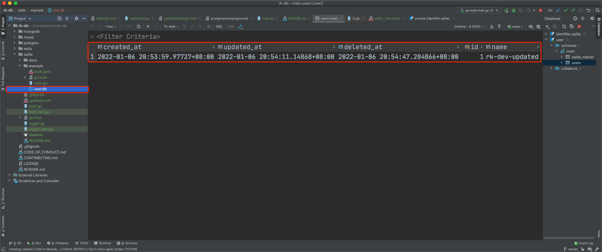

# Example

<!-- START doctoc generated TOC please keep comment here to allow auto update -->
<!-- DON'T EDIT THIS SECTION, INSTEAD RE-RUN doctoc TO UPDATE -->
**Table of Contents**  *generated with [DocToc](https://github.com/thlorenz/doctoc)*

- [Quick Start](#quick-start)
  - [Installation](#installation)
  - [1.Create boot.yaml](#1create-bootyaml)
  - [2.Create main.go](#2create-maingo)
  - [3.Start server](#3start-server)
  - [4.Validation](#4validation)
    - [4.1 Create user](#41-create-user)
    - [4.1 Update user](#41-update-user)
    - [4.1 List users](#41-list-users)
    - [4.1 Get user](#41-get-user)
    - [4.1 Delete user](#41-delete-user)
- [YAML Options](#yaml-options)
  - [Usage of locale](#usage-of-locale)

<!-- END doctoc generated TOC please keep comment here to allow auto update -->

## Quick Start
In the bellow example, we will run SQLite locally and implement API of Create/List/Get/Update/Delete for User model with Gin.

- GET /v1/user, List users
- GET /v1/user/:id, Get user
- PUT /v1/user, Create user
- POST /v1/user/:id, Update user
- DELETE /v1/user/:id, Delete user

### Installation
In this example, we will start a web service with gin. As a result, bellow dependencies should be installed.

```
go get github.com/rookie-ninja/rk-boot/gin
go get github.com/rookie-ninja/rk-boot/database/sqlite
```

### 1.Create boot.yaml
- Create web server with Gin framework at port 8080
- Create Sqlite entry which connects Sqlite at file path or in memory

```yaml
---
gin:
  - name: user-service
    port: 8080
    enabled: true
sqlite:
  - name: user                        # Required
    enabled: true                     # Required
    locale: "*::*::*::*"              # Required
    database:
      - name: user-meta               # Required
#        inMemory: true               # Optional, default: false
#        dbDir: ""                    # Optional, default: "", directory where db file created or imported, can be absolute or relative path
#        dryRun: true                 # Optional, default: false
#        params: []                   # Optional, default: ["cache=shared"]
#    logger:
#      zapLogger: zap                 # Optional, default: default logger with STDOUT
```

### 2.Create main.go
In the main() function, we implement two things.

- Add User{} as auto migrate option which will create table in DB automatically if missing.
- Register APIs into Gin router.

```go
// Copyright (c) 2021 rookie-ninja
//
// Use of this source code is governed by an Apache-style
// license that can be found in the LICENSE file.
package main

import (
	"context"
	"github.com/gin-gonic/gin"
	"github.com/rookie-ninja/rk-boot"
	"github.com/rookie-ninja/rk-boot/database/sqlite"
	"github.com/rookie-ninja/rk-boot/gin"
	"gorm.io/gorm"
	"net/http"
	"strconv"
	"time"
)

var userDb *gorm.DB

func main() {
	boot := rkboot.NewBoot()

	boot.Bootstrap(context.TODO())

	// Auto migrate database and init global userDb variable
	userDb = rkbootsqlite.GetGormDb("user", "user-meta")

	if !userDb.DryRun {
		userDb.AutoMigrate(&User{})
	}

	// Register APIs
	ginEntry := rkbootgin.GetGinEntry("user-service")
	ginEntry.Router.GET("/v1/user", ListUsers)
	ginEntry.Router.GET("/v1/user/:id", GetUser)
	ginEntry.Router.PUT("/v1/user", CreateUser)
	ginEntry.Router.POST("/v1/user/:id", UpdateUser)
	ginEntry.Router.DELETE("/v1/user/:id", DeleteUser)

	boot.WaitForShutdownSig(context.TODO())
}

// *************************************
// *************** Model ***************
// *************************************

type Base struct {
	CreatedAt time.Time      `yaml:"-" json:"-"`
	UpdatedAt time.Time      `yaml:"-" json:"-"`
	DeletedAt gorm.DeletedAt `yaml:"-" json:"-" gorm:"index"`
}

type User struct {
	Base
	Id   int    `yaml:"id" json:"id" gorm:"primaryKey"`
	Name string `yaml:"name" json:"name"`
}

func ListUsers(ctx *gin.Context) {
	userList := make([]*User, 0)
	res := userDb.Find(&userList)

	if res.Error != nil {
		ctx.JSON(http.StatusInternalServerError, res.Error)
		return
	}
	ctx.JSON(http.StatusOK, userList)
}

func GetUser(ctx *gin.Context) {
	uid := ctx.Param("id")
	user := &User{}
	res := userDb.Where("id = ?", uid).Find(user)

	if res.Error != nil {
		ctx.JSON(http.StatusInternalServerError, res.Error)
		return
	}
	ctx.JSON(http.StatusOK, user)
}

func CreateUser(ctx *gin.Context) {
	user := &User{
		Name: ctx.Query("name"),
	}

	res := userDb.Create(user)

	if res.Error != nil {
		ctx.JSON(http.StatusInternalServerError, res.Error)
		return
	}
	ctx.JSON(http.StatusOK, user)
}

func UpdateUser(ctx *gin.Context) {
	uid := ctx.Param("id")
	user := &User{
		Name: ctx.Query("name"),
	}

	res := userDb.Where("id = ?", uid).Updates(user)

	if res.Error != nil {
		ctx.JSON(http.StatusInternalServerError, res.Error)
		return
	}

	if res.RowsAffected < 1 {
		ctx.JSON(http.StatusNotFound, "user not found")
		return
	}

	// get user
	userDb.Where("id = ?", uid).Find(user)

	ctx.JSON(http.StatusOK, user)
}

func DeleteUser(ctx *gin.Context) {
	uid, _ := strconv.Atoi(ctx.Param("id"))
	res := userDb.Delete(&User{
		Id: uid,
	})

	if res.Error != nil {
		ctx.JSON(http.StatusInternalServerError, res.Error)
		return
	}

	if res.RowsAffected < 1 {
		ctx.JSON(http.StatusNotFound, "user not found")
		return
	}

	ctx.String(http.StatusOK, "success")
}
```

### 3.Start server

```
$ go run main.go

2022-01-09T04:18:12.408+0800    INFO    Bootstrap SQLite entry  {"entryName": "user"}
2022-01-09T04:18:12.408+0800    INFO    connecting to database user-meta
2022-01-09T04:18:12.410+0800    INFO    connecting to database user-meta success
2022-01-09T04:18:12.410+0800    INFO    boot/gin_entry.go:913   Bootstrap ginEntry      {"eventId": "d2c38f14-b255-4ddb-809c-082873eb68e4", "entryName": "user-service"}
------------------------------------------------------------------------
endTime=2022-01-09T04:18:12.410298+08:00
startTime=2022-01-09T04:18:12.410248+08:00
elapsedNano=49746
timezone=CST
ids={"eventId":"d2c38f14-b255-4ddb-809c-082873eb68e4"}
app={"appName":"rk","appVersion":"","entryName":"user-service","entryType":"GinEntry"}
env={"arch":"amd64","az":"*","domain":"*","hostname":"lark.local","localIP":"10.8.0.2","os":"darwin","realm":"*","region":"*"}
payloads={"ginPort":8080}
error={}
counters={}
pairs={}
timing={}
remoteAddr=localhost
operation=Bootstrap
resCode=OK
eventStatus=Ended
EOE
```

A user-meta.db file will be created.

```
$ tree
.
├── Makefile
├── README.md
├── boot.yaml
├── go.mod
├── go.sum
├── main.go
└── user-meta.db

0 directories, 7 files
```


### 4.Validation
#### 4.1 Create user
Create a user with name of rk-dev.

```shell script
$ curl -X PUT "localhost:8080/v1/user?name=rk-dev"
{"id":1,"name":"rk-dev"}
```

#### 4.1 Update user
Update user name to rk-dev-updated.

```shell script
$ curl -X POST "localhost:8080/v1/user/1?name=rk-dev-updated"
{"id":1,"name":"rk-dev-updated"}
```

#### 4.1 List users
List users.

```shell script
$ curl -X GET localhost:8080/v1/user
[{"id":1,"name":"rk-dev-updated"}]
```

#### 4.1 Get user
Get user with id=1.

```shell script
$ curl -X GET localhost:8080/v1/user/1
{"id":1,"name":"rk-dev-updated"}
```

#### 4.1 Delete user

```shell script
$ curl -X DELETE localhost:8080/v1/user/1
success
```



## YAML Options
User can start multiple [gorm](https://github.com/go-gorm/gorm) instances at the same time. Please make sure use different names.

| name | Required | description | type | default value |
| ------ | ------ | ------ | ------ | ------ |
| sqlite.name | Required | The name of entry | string | SQLite |
| sqlite.enabled | Required | Enable entry or not | bool | false |
| sqlite.locale | Required | See locale description bellow | string | "" |
| sqlite.description | Optional | Description of echo entry. | string | "" |
| sqlite.database.name | Required | Name of database | string | "" |
| sqlite.database.inMemory | Optional | SQLite in memory | bool | false |
| sqlite.database.dbDir | Optional | Specify *.db file directory | string | "", current working directory if empty |
| sqlite.database.dryRun | Optional | Run gorm.DB with dry run mode | bool | false |
| sqlite.database.params | Optional | Connection params | []string | ["cache=shared"] |
| sqlite.logger.zapLogger | Optional | Reference of zap logger entry name | string | "" |

### Usage of locale

```
RK use <realm>::<region>::<az>::<domain> to distinguish different environment.
Variable of <locale> could be composed as form of <realm>::<region>::<az>::<domain>
- realm: It could be a company, department and so on, like RK-Corp.
         Environment variable: REALM
         Eg: RK-Corp
         Wildcard: supported

- region: Please see AWS web site: https://docs.aws.amazon.com/AWSEC2/latest/UserGuide/using-regions-availability-zones.html
          Environment variable: REGION
          Eg: us-east
          Wildcard: supported

- az: Availability zone, please see AWS web site for details: https://docs.aws.amazon.com/AWSEC2/latest/UserGuide/using-regions-availability-zones.html
      Environment variable: AZ
      Eg: us-east-1
      Wildcard: supported

- domain: Stands for different environment, like dev, test, prod and so on, users can define it by themselves.
          Environment variable: DOMAIN
          Eg: prod
          Wildcard: supported

How it works?
First, we will split locale with "::" and extract realm, region, az and domain.
Second, get environment variable named as REALM, REGION, AZ and DOMAIN.
Finally, compare every element in locale variable and environment variable.
If variables in locale represented as wildcard(*), we will ignore comparison step.

Example:
# let's assuming we are going to define DB address which is different based on environment.
# Then, user can distinguish DB address based on locale.
# We recommend to include locale with wildcard.
---
DB:
  - name: redis-default
    locale: "*::*::*::*"
    addr: "192.0.0.1:6379"
  - name: redis-in-test
    locale: "*::*::*::test"
    addr: "192.0.0.1:6379"
  - name: redis-in-prod
    locale: "*::*::*::prod"
    addr: "176.0.0.1:6379"
```
