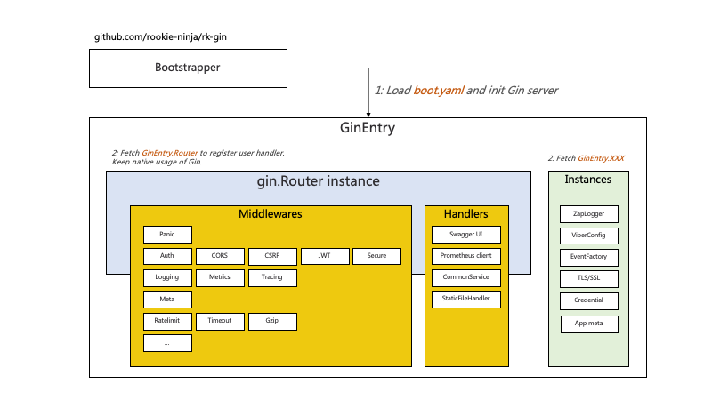

# Example
Middleware & bootstrapper designed for [gin-gonic/gin](https://github.com/gin-gonic/gin) web framework. 

## Documentation
- [Github](https://github.com/rookie-ninja/rk-gin)
- [Official Docs]() will be updated for v2 soon



## Installation
[rk-boot](https://github.com/rookie-ninja/rk-boot) is required one for all RK family. We pulled rk-gin as dependency since we are testing GIN.

```shell
go get github.com/rookie-ninja/rk-boot/v2
go get github.com/rookie-ninja/rk-gin/v2
```

## Quick start
### 1.Create boot.yaml
```yaml
---
gin:
  - name: greeter                                          # Required
    port: 8080                                             # Required
    enabled: true                                          # Required
    sw:
      enabled: true                                        # Optional, default: false
    docs:
      enabled: true                                        # Optional, default: false
```

### 2.Create main.go
```go
// Copyright (c) 2021 rookie-ninja
//
// Use of this source code is governed by an Apache-style
// license that can be found in the LICENSE file.

package main

import (
  "context"
  "github.com/gin-gonic/gin"
  "github.com/rookie-ninja/rk-boot/v2"
  "github.com/rookie-ninja/rk-gin/v2/boot"
  "net/http"
)

// @title Swagger Example API
// @version 1.0
// @description This is a sample rk-demo server.
// @termsOfService http://swagger.io/terms/

// @securityDefinitions.basic BasicAuth

// @contact.name API Support
// @contact.url http://www.swagger.io/support
// @contact.email support@swagger.io

// @license.name Apache 2.0
// @license.url http://www.apache.org/licenses/LICENSE-2.0.html
func main() {
  // Create a new boot instance.
  boot := rkboot.NewBoot()

  // Register handler
  entry := rkgin.GetGinEntry("greeter")
  entry.Router.GET("/v1/hello", hello)

  // Bootstrap
  boot.Bootstrap(context.TODO())

  boot.WaitForShutdownSig(context.TODO())
}

// @Summary Hello
// @Id 1
// @Tags Hello
// @version 1.0
// @produce application/json
// @Success 200 string string
// @Router /v1/hello [get]
func hello(ctx *gin.Context) {
  ctx.JSON(http.StatusOK, gin.H{
    "message": "hello!",
  })
}
```

### 3.Start server

```go
$ go run main.go
```

### 4.Validation
- Call API:

```shell script
$ curl -X GET localhost:8080/v1/greeter
{"message":"hello!"}

$ curl -X GET localhost:8080/rk/v1/ready
{
  "ready": true
}

$ curl -X GET localhost:8080/rk/v1/alive
{
  "alive": true
}
```

- Swagger UI: [http://localhost:8080/sw](http://localhost:8080/sw)


- Docs UI via: [http://localhost:8080/docs](http://localhost:8080/docs)


