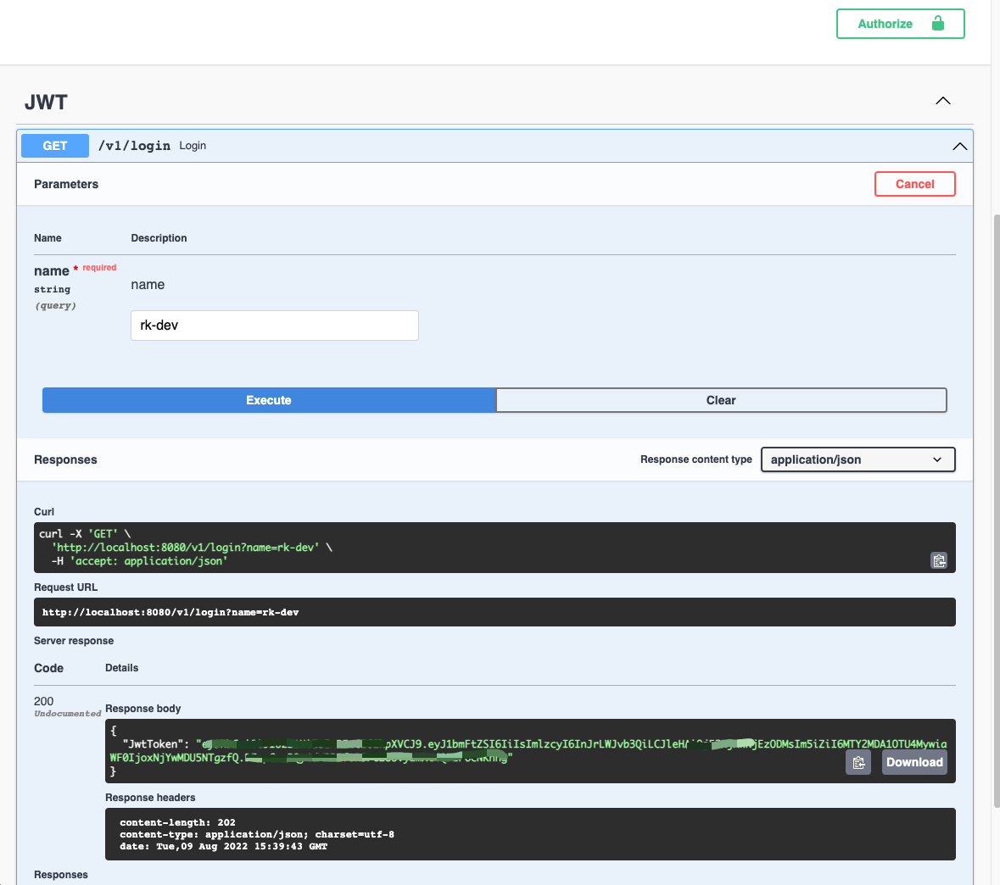
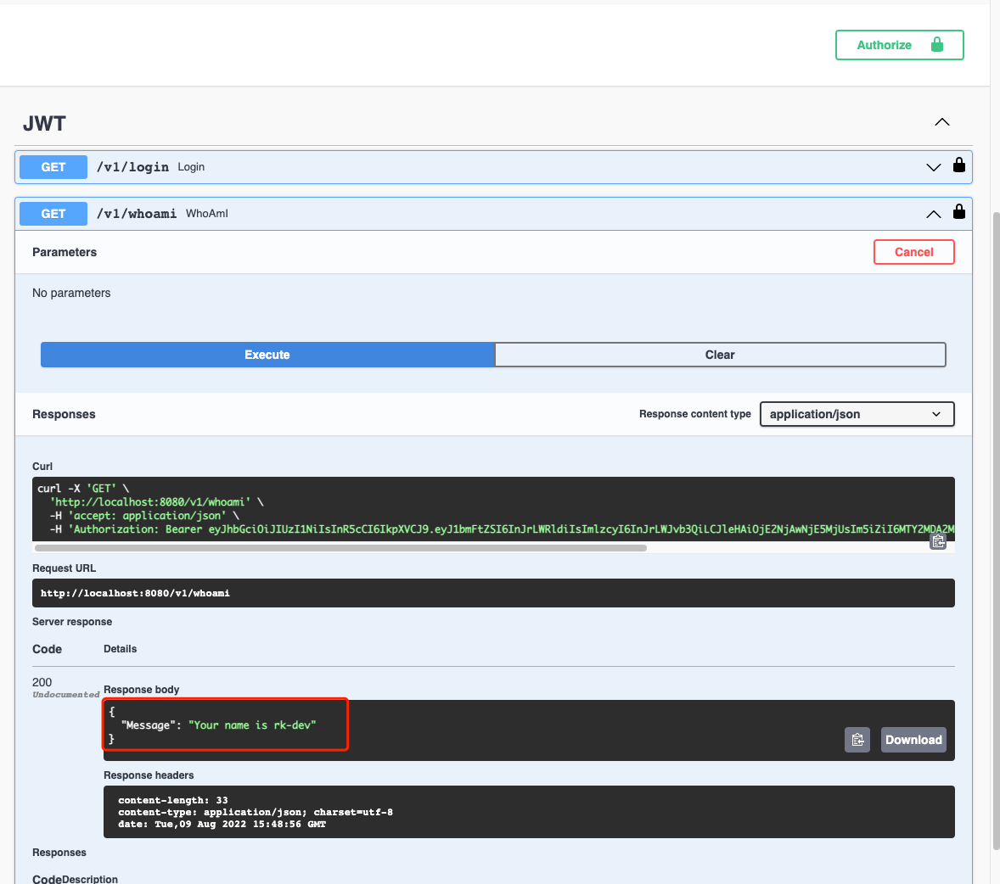

# Example
Implementation of JWT middleware with Login logic.

## Documentation
- [Github](https://github.com/rookie-ninja/rk-gin)
- [Official Docs](https://docs.rkdev.info)

## Quick start
### 1.Create boot.yaml
```yaml
---
gin:
  - name: greeter
    port: 8080
    enabled: true
    sw:
      enabled: true
    middleware:
      jwt:
        enabled: true
        ignore:
          - "/v1/login"
          - "/sw"

```

### 2.Create main.go
```go
// Copyright (c) 2021 rookie-ninja
//
// Use of this source code is governed by an Apache-style
// license that can be found in the LICENSE file.

package main

import (
	"context"
	"encoding/json"
	"fmt"
	"github.com/gin-gonic/gin"
	"github.com/golang-jwt/jwt/v4"
	"github.com/rookie-ninja/rk-boot/v2"
	"github.com/rookie-ninja/rk-entry/v2/entry"
	"github.com/rookie-ninja/rk-gin/v2/boot"
	"github.com/rookie-ninja/rk-gin/v2/middleware/context"
	"net/http"
	"time"
)

// @title Swagger Example API
// @version 1.0
// @description This is a sample rk-boot server.
// @termsOfService http://swagger.io/terms/

// @securityDefinitions.apikey JWT
// @in header
// @name Authorization

// @contact.name API Support
// @contact.url http://www.swagger.io/support
// @contact.email support@swagger.io

// @license.name Apache 2.0
// @license.url http://www.apache.org/licenses/LICENSE-2.0.html
func main() {
	// Create a new boot instance.
	boot := rkboot.NewBoot()

	// Register handler
	entry := rkgin.GetGinEntry("greeter")
	entry.Router.GET("/v1/login", Login)
	entry.Router.GET("/v1/whoami", WhoAmI)

	// Bootstrap
	boot.Bootstrap(context.TODO())

	boot.WaitForShutdownSig(context.TODO())
}

// CustomClaims defines JWT claims
type CustomClaims struct {
	UserName string `json:"uname"`
	jwt.RegisteredClaims
}

// Login handler
// @Summary Login
// @Id 1
// @Tags JWT
// @version 1.0
// @Security  JWT
// @Param name query string true "name"
// @produce application/json
// @Router /v1/login [get]
func Login(ctx *gin.Context) {
	// Simply generate JWT token from user provided name for demo
	userName := ctx.Query("name")

	now := time.Now()
	claims := CustomClaims{
		UserName: userName,
		RegisteredClaims: jwt.RegisteredClaims{
			ExpiresAt: jwt.NewNumericDate(now.Add(30 * time.Minute)),
			IssuedAt:  jwt.NewNumericDate(now),
			NotBefore: jwt.NewNumericDate(now),
			Issuer:    "rk-boot",
		},
	}

	// By default, JWT middleware will create a new SignerEntry with the same name of Gin Entry
	// default signer entry will use symmetric algorithm (HS256) with token of (rk jwt key)
	// refer rkmidjwt.NewOptionSet
	signerEntry := rkentry.GlobalAppCtx.GetSignerJwtEntry("greeter")

	res, _ := signerEntry.SignJwt(claims)
	ctx.JSON(http.StatusOK, map[string]string{
		"JwtToken": res,
	})
}

// WhoAmI handler
// @Summary WhoAmI
// @Id 2
// @Tags JWT
// @version 1.0
// @Security  JWT
// @produce application/json
// @Router /v1/whoami [get]
func WhoAmI(ctx *gin.Context) {
	// 1: get JWT token from context which injected into context by middleware
	token := rkginctx.GetJwtToken(ctx)

	// convert claim to custom claim
	claims := &CustomClaims{}
	bytes, _ := json.Marshal(token.Claims)
	json.Unmarshal(bytes, claims)

	ctx.JSON(http.StatusOK, map[string]string{
		"Message": fmt.Sprintf("Your name is %s", claims.UserName),
	})
}

```

### 3.Start server

```shell
go run main.go
```

### 4.Validation
- [Swagger](http://localhost:8080/sw)

- Login



- Authorise JWT in Swagger

Copy returned JWT token and authorise JWT


- Send /v1/whoami

