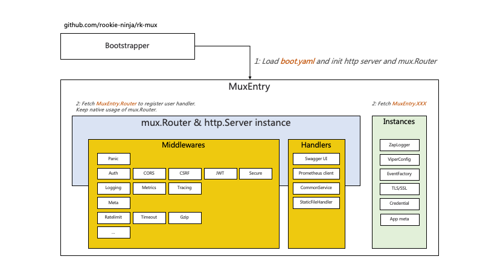

# Example
Middleware & bootstrapper designed for [gorilla/mux](https://github.com/gorilla/mux) web framework. 

## Documentation
- [Github](https://github.com/rookie-ninja/rk-mux)
- [Official Docs]() will be updated for v2 soon



## Installation
[rk-boot](https://github.com/rookie-ninja/rk-boot) is required one for all RK family. We pulled rk-gin as dependency since we are testing GIN.

```shell
go get github.com/rookie-ninja/rk-boot/v2
go get github.com/rookie-ninja/rk-mux
```

## Quick start
### 1.Create boot.yaml
```yaml
---
mux:
  - name: greeter                                          # Required
    port: 8080                                             # Required
    enabled: true                                          # Required
    commonService:
      enabled: true                                       # Optional, default: false
    sw:
      enabled: true                                        # Optional, default: false
    docs:
      enabled: true                                        # Optional, default: false
```

### 2.Create main.go
```go
// Copyright (c) 2021 rookie-ninja
//
// Use of this source code is governed by an Apache-style
// license that can be found in the LICENSE file.
package main

import (
	"context"
	_ "embed"
	"fmt"
	"github.com/rookie-ninja/rk-boot/v2"
	"github.com/rookie-ninja/rk-mux/boot"
	"github.com/rookie-ninja/rk-mux/middleware"
	"net/http"
)

// @title RK Swagger for Mux
// @version 1.0
// @description This is a greeter service with rk-boot.
func main() {
	// Create a new boot instance.
	boot := rkboot.NewBoot()

	// Get MuxEntry
	muxEntry := rkmux.GetMuxEntry("greeter")
	// Use *mux.Router adding handler.
	muxEntry.Router.NewRoute().Path("/v1/greeter").HandlerFunc(Greeter)

	// Bootstrap
	boot.Bootstrap(context.TODO())

	boot.WaitForShutdownSig(context.TODO())
}

// Greeter handler
// @Summary Greeter service
// @Id 1
// @version 1.0
// @produce application/json
// @Param name query string true "Input name"
// @Success 200 {object} GreeterResponse
// @Router /v1/greeter [get]
func Greeter(writer http.ResponseWriter, req *http.Request) {
	rkmuxmid.WriteJson(writer, http.StatusOK, &GreeterResponse{
		Message: fmt.Sprintf("Hello %s!", req.URL.Query().Get("name")),
	})
}

type GreeterResponse struct {
	Message string
}
```

### 3.Start server

```go
$ go run main.go
```

### 4.Validation
- Call API:

```shell script
$ curl -X GET localhost:8080/v1/greeter?name=rk-dev
{"Message":"Hello rk-dev!"}

$ curl -X GET localhost:8080/rk/v1/ready
{
  "ready": true
}

$ curl -X GET localhost:8080/rk/v1/alive
{
  "alive": true
}
```

- Swagger UI: [http://localhost:8080/sw](http://localhost:8080/sw)


- Docs UI via: [http://localhost:8080/docs](http://localhost:8080/docs)


