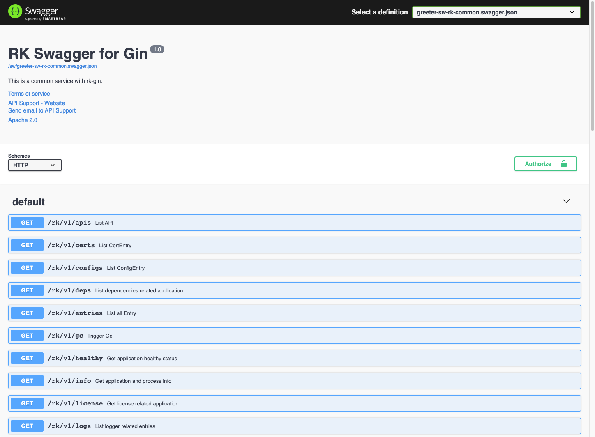
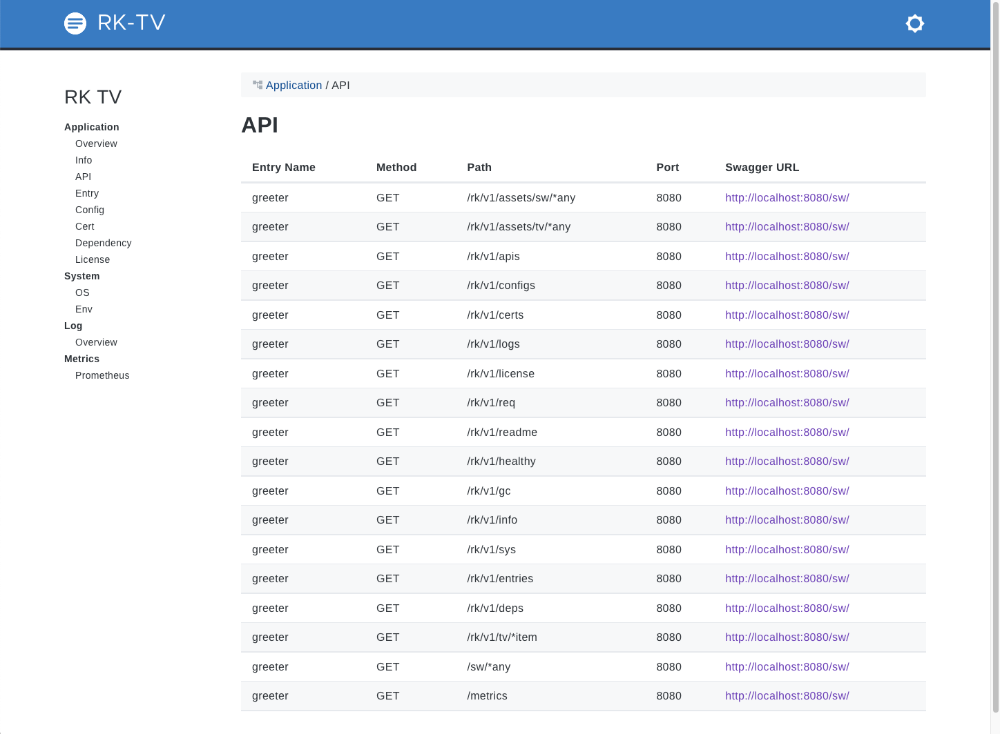
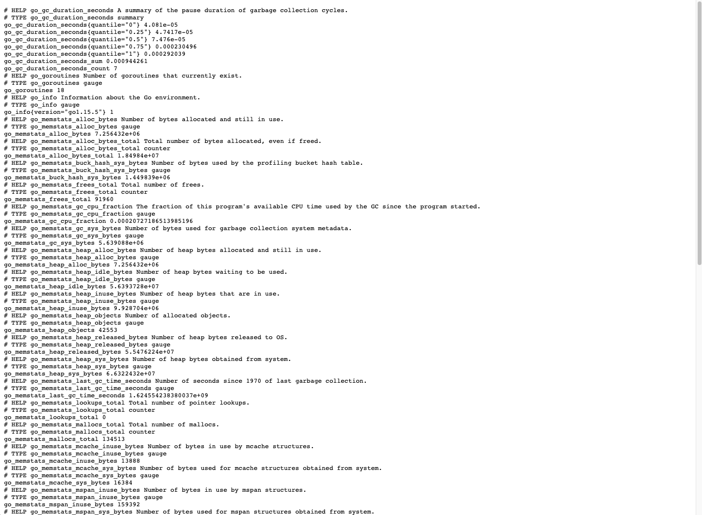
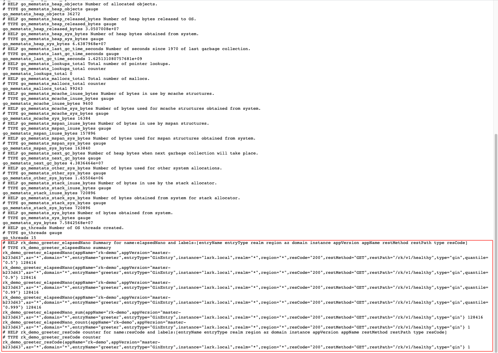

<!-- START doctoc generated TOC please keep comment here to allow auto update -->
<!-- DON'T EDIT THIS SECTION, INSTEAD RE-RUN doctoc TO UPDATE -->
**Table of Contents**  *generated with [DocToc](https://github.com/thlorenz/doctoc)*

- [Example](#example)
  - [Installation](#installation)
  - [Quick Start](#quick-start)
    - [1.Create boot.yaml](#1create-bootyaml)
    - [2.Create main.go](#2create-maingo)
    - [3.Start server](#3start-server)
    - [4.Validation](#4validation)

<!-- END doctoc generated TOC please keep comment here to allow auto update -->

# Example
Full documentations:
- [rkdev.info](https://rkdev.info/docs/bootstrapper/user-guide/gin-golang/)
- [rk-gin](https://github.com/rookie-ninja/rk-gin)

Interceptor & bootstrapper designed for [gin-gonic/gin](https://github.com/gin-gonic/gin) web framework. 


## Installation
`go get github.com/rookie-ninja/rk-boot/gin`

## Quick Start
In the bellow example, we will start microservice with bellow functionality and middlewares enabled via YAML.

- [gin-gonic/gin](https://github.com/gin-gonic/gin) server
- Swagger UI
- CommonService
- TV
- Prometheus Metrics (middleware)
- Logging (middleware)
- Meta (middleware)

### 1.Create boot.yaml
```yaml
---
gin:
  - name: greeter
    port: 8080
    enabled: true
    sw:
      enabled: true
      jsonPath: "docs"
    commonService:
      enabled: true
    tv:
      enabled:  true
    prom:
      enabled: true
    interceptors:
      loggingZap:
        enabled: true
      metricsProm:
        enabled: true
      meta:
        enabled: true
```

### 2.Create main.go
```go
// Copyright (c) 2021 rookie-ninja
//
// Use of this source code is governed by an Apache-style
// license that can be found in the LICENSE file.

package main

import (
	"context"
	"github.com/gin-gonic/gin"
	"github.com/rookie-ninja/rk-boot"
	"github.com/rookie-ninja/rk-boot/gin"
	"net/http"
)

// @title Swagger Example API
// @version 1.0
// @description This is a sample rk-demo server.
// @termsOfService http://swagger.io/terms/

// @securityDefinitions.basic BasicAuth

// @contact.name API Support
// @contact.url http://www.swagger.io/support
// @contact.email support@swagger.io

// @license.name Apache 2.0
// @license.url http://www.apache.org/licenses/LICENSE-2.0.html
func main() {
	// Create a new boot instance.
	boot := rkboot.NewBoot()

	// Register handler
	entry := rkbootgin.GetGinEntry("greeter")
	entry.Router.GET("/v1/hello", hello)

	// Bootstrap
	boot.Bootstrap(context.TODO())

	// Wait for shutdown sig
	boot.WaitForShutdownSig(context.TODO())
}

// @Summary Hello
// @Id 1
// @Tags Hello
// @version 1.0
// @produce application/json
// @Success 200 string string
// @Router /v1/hello [get]
func hello(ctx *gin.Context) {
	ctx.JSON(http.StatusOK, gin.H{
		"message": "hello!",
	})
}
```

### 3.Start server

```go
$ go run main.go
```

### 4.Validation
#### 4.1 Gin server
Try to test Gin Service with [curl](https://curl.se/)

```shell script
# Curl to common service
$ curl localhost:8080/rk/v1/healthy
{"healthy":true}
```

#### 4.2 Swagger UI
Please refer [documentation](https://rkdev.info/docs/bootstrapper/user-guide/gin-golang/basic/swagger-ui/) for details of configuration.

By default, we could access swagger UI at [http://localhost:8080/sw](http://localhost:8080/sw)



#### 4.3 TV
Please refer [documentation](https://rkdev.info/docs/bootstrapper/user-guide/gin-golang/basic/tv/) for details of configuration.

By default, we could access TV at [http://localhost:8080/rk/v1/tv](http://localhost:8080/rk/v1/tv)



#### 4.4 Prometheus Metrics
Please refer [documentation](https://rkdev.info/docs/bootstrapper/user-guide/gin-golang/basic/middleware-metrics/) for details of configuration.

By default, we could access prometheus client at [http://localhost:8080/metrics](http://localhost:8080/metrics)
- http://localhost:8080/metrics



#### 4.5 Logging
Please refer [documentation](https://rkdev.info/docs/bootstrapper/user-guide/gin-golang/basic/middleware-logging/) for details of configuration.

By default, we enable zap logger and event logger with encoding type of [console]. Encoding type of [json] is also supported.

```shell script
2021-12-29T04:04:43.240+0800    INFO    boot/gin_entry.go:913   Bootstrap ginEntry      {"eventId": "c4f852e2-2725-4307-907d-8d2d5453a3e8", "entryName": "greeter"}
------------------------------------------------------------------------
endTime=2021-12-29T04:04:43.24209+08:00
startTime=2021-12-29T04:04:43.240643+08:00
elapsedNano=1446739
timezone=CST
ids={"eventId":"c4f852e2-2725-4307-907d-8d2d5453a3e8"}
app={"appName":"rk","appVersion":"","entryName":"greeter","entryType":"GinEntry"}
env={"arch":"amd64","az":"*","domain":"*","hostname":"lark.local","localIP":"10.8.0.2","os":"darwin","realm":"*","region":"*"}
payloads={"commonServiceEnabled":true,"commonServicePathPrefix":"/rk/v1/","ginPort":8080,"promEnabled":true,"promPath":"/metrics","promPort":8080,"swEnabled":true,"swPath":"/sw/","tvEnabled":true,"tvPath":"/rk/v1/tv/"}
error={}
counters={}
pairs={}
timing={}
remoteAddr=localhost
operation=Bootstrap
resCode=OK
eventStatus=Ended
EOE
```

#### 4.6 Meta
Please refer [documentation](https://rkdev.info/docs/bootstrapper/user-guide/gin-golang/basic/middleware-meta/) for details of configuration.

By default, we will send back some metadata to client including gateway with headers.

```shell script
$ curl -vs localhost:8080/rk/v1/healthy
*   Trying ::1...
* TCP_NODELAY set
* Connected to localhost (::1) port 8080 (#0)
> GET /rk/v1/healthy HTTP/1.1
> Host: localhost:8080
> User-Agent: curl/7.64.1
> Accept: */*
>
< HTTP/1.1 200 OK
< Content-Type: application/json; charset=utf-8
< X-Request-Id: fdad3389-cf1a-44b2-b5d5-ec5155cac65b
< X-Rk-App-Name: rk
< X-Rk-App-Unix-Time: 2021-12-29T04:08:12.345709+08:00
< X-Rk-Received-Time: 2021-12-29T04:08:12.345709+08:00
< Date: Tue, 28 Dec 2021 20:08:12 GMT
< Content-Length: 16
<
* Connection #0 to host localhost left intact
{"healthy":true}
```

#### 4.7 Send request
We registered /v1/hello API in [gin-gonic/gin](https://github.com/gin-gonic/gin) server and let's validate it!

```shell script
$ curl -vs localhost:8080/v1/hello
*   Trying ::1...
* TCP_NODELAY set
* Connected to localhost (::1) port 8080 (#0)
> GET /v1/hello HTTP/1.1
> Host: localhost:8080
> User-Agent: curl/7.64.1
> Accept: */*
>
< HTTP/1.1 200 OK
< Content-Type: application/json; charset=utf-8
< X-Request-Id: 055559d9-26f4-4967-87c4-930d387b292a
< X-Rk-App-Name: rk
< X-Rk-App-Unix-Time: 2021-12-29T04:05:10.961611+08:00
< X-Rk-Received-Time: 2021-12-29T04:05:10.961611+08:00
< Date: Tue, 28 Dec 2021 20:05:10 GMT
< Content-Length: 20
<
* Connection #0 to host localhost left intact
{"message":"hello!"}
```

#### 4.8 RPC logs
Bellow logs would be printed in stdout.

```
------------------------------------------------------------------------
endTime=2021-12-29T04:05:10.961848+08:00
startTime=2021-12-29T04:05:10.961592+08:00
elapsedNano=256314
timezone=CST
ids={"eventId":"055559d9-26f4-4967-87c4-930d387b292a","requestId":"055559d9-26f4-4967-87c4-930d387b292a"}
app={"appName":"rk","appVersion":"","entryName":"greeter","entryType":"GinEntry"}
env={"arch":"amd64","az":"*","domain":"*","hostname":"lark.local","localIP":"10.8.0.2","os":"darwin","realm":"*","region":"*"}
payloads={"apiMethod":"GET","apiPath":"/v1/hello","apiProtocol":"HTTP/1.1","apiQuery":"","userAgent":"curl/7.64.1"}
error={}
counters={}
pairs={}
timing={}
remoteAddr=localhost:57911
operation=/v1/hello
resCode=200
eventStatus=Ended
EOE
```

#### 4.9 RPC prometheus metrics
Prometheus client will automatically register into [gin-gonic/gin](https://github.com/gin-gonic/gin) instance at /metrics.

Access [http://localhost:8080/metrics](http://localhost:8080/metrics)

