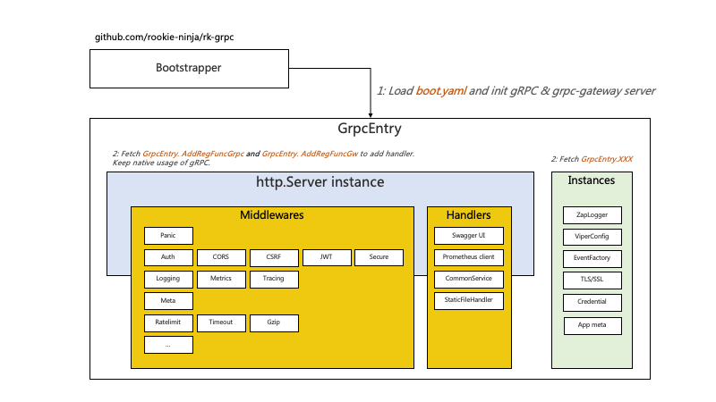

# Example
Middleware & bootstrapper designed for [gRPC](https://grpc.io/docs/languages/go/) and [grpc-gateway](https://github.com/grpc-ecosystem/grpc-gateway).

## Documentation
- [Github](https://github.com/rookie-ninja/rk-grpc)
- [Official Docs]() will be updated for v2 soon



## Installation
- rk-boot: Bootstrapper base
- rk-grpc: Bootstrapper for [gRPC](https://grpc.io/docs/languages/go/) & [grpc-gateway](https://github.com/grpc-ecosystem/grpc-gateway)

```shell
go get github.com/rookie-ninja/rk-boot/v2
go get github.com/rookie-ninja/rk-grpc/v2
```

## Quick start
### 1.Prepare .proto files
- api/v1/greeter.proto

```protobuf
syntax = "proto3";

package api.v1;

option go_package = "api/v1/hello";

service Greeter {
  rpc Hello (HelloRequest) returns (HelloResponse) {}
}

message HelloRequest {}

message HelloResponse {
  string my_message = 1;
}
```

- api/v1/gw_mapping.yaml

```yaml
type: google.api.Service
config_version: 3

# Please refer google.api.Http in third-party/googleapis/google/api/http.proto file for details.
http:
  rules:
    - selector: api.v1.Greeter.Hello
      get: /v1/hello
```

- buf.yaml

```yaml
version: v1beta1
name: github.com/rk-dev/rk-boot
build:
  roots:
    - api
    - third-party/googleapis
```

- buf.gen.yaml

```yaml
version: v1beta1
plugins:
  - name: go
    out: api/gen
    opt:
     - paths=source_relative
  - name: go-grpc
    out: api/gen
    opt:
      - paths=source_relative
      - require_unimplemented_servers=false
  - name: grpc-gateway
    out: api/gen
    opt:
      - paths=source_relative
      - grpc_api_configuration=api/v1/gw_mapping.yaml
      - allow_repeated_fields_in_body=true
      - generate_unbound_methods=true
  - name: openapiv2
    out: api/gen
    opt:
      - grpc_api_configuration=api/v1/gw_mapping.yaml
      - allow_repeated_fields_in_body=true
```

### 2.Generate .pb.go files with [buf](https://docs.buf.build/introduction)
```
$ buf generate --path api/v1
```

### 4.Create boot.yaml
Important note: rk-boot will bind grpc and grpc-gateway in the same port which we think is a convenient way.

As a result, grpc-gateway will automatically be started.

```yaml
---
grpc:
  - name: greeter                                          # Required
    enabled: true                                          # Required
    port: 8080                                             # Required
    enableReflection: true                                 # Optional, default: false
    enableRkGwOption: true                                 # Optional, default: false
    commonService:
      enabled: true                                        # Optional, default: false
    sw:
      enabled: true                                        # Optional, default: false
    docs:
      enabled: true                                        # Optional, default: false
```

### 5.Create main.go
```go
// Copyright (c) 2021 rookie-ninja
//
// Use of this source code is governed by an Apache-style
// license that can be found in the LICENSE file.

package main

import (
	"context"
	"github.com/rookie-ninja/rk-boot/v2"
	"github.com/rookie-ninja/rk-demo/api/gen/v1"
	"github.com/rookie-ninja/rk-grpc/v2/boot"
	"google.golang.org/grpc"
)

func main() {
	boot := rkboot.NewBoot()

	// register grpc
	entry := rkgrpc.GetGrpcEntry("greeter")
	entry.AddRegFuncGrpc(registerGreeter)
	entry.AddRegFuncGw(hello.RegisterGreeterHandlerFromEndpoint)

	// Bootstrap
	boot.Bootstrap(context.TODO())

	// Wait for shutdown sig
	boot.WaitForShutdownSig(context.TODO())
}

func registerGreeter(server *grpc.Server) {
	hello.RegisterGreeterServer(server, &GreeterServer{})
}

//GreeterServer GreeterServer struct
type GreeterServer struct{}

// Hello response with hello message
func (server *GreeterServer) Hello(_ context.Context, _ *hello.HelloRequest) (*hello.HelloResponse, error) {
	return &hello.HelloResponse{
		MyMessage: "hello!",
	}, nil
}
```

### 6.Start server

```go
$ go run main.go
```

### 7.Validation
- Call API:

```shell script
$ curl -X GET localhost:8080/v1/greeter
{"myMessage":"hello!"}

$ curl -X GET localhost:8080/rk/v1/ready
{
  "ready": true
}

$ curl -X GET localhost:8080/rk/v1/alive
{
  "alive": true
}
```

- Swagger UI: [http://localhost:8080/sw](http://localhost:8080/sw)


- Docs UI via: [http://localhost:8080/docs](http://localhost:8080/docs)


